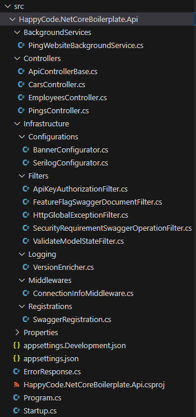
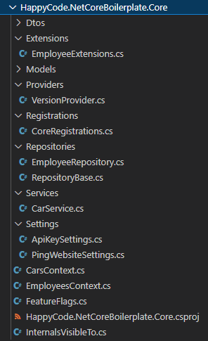
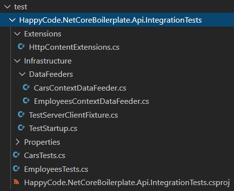
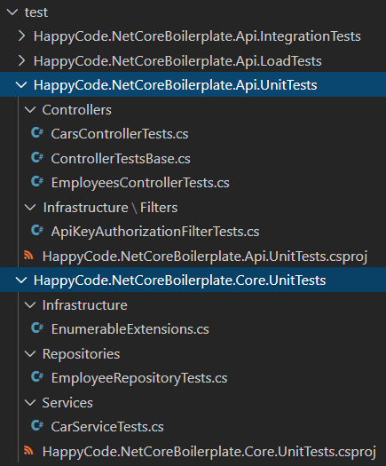
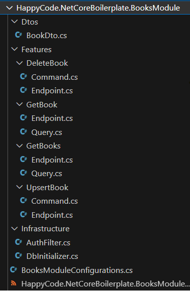
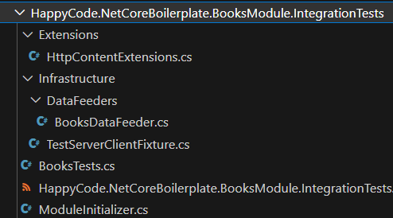

# netcore-boilerplate

Boilerplate of API in `.NET 8`

| GitHub | Codecov | Docker Hub |
|:------:|:-------:|:----------:|
|   |  |  |

Boilerplate is a piece of code that helps you to quickly kick-off a project or start writing your source code.
It is kind of a template - instead of starting an empty project and adding the same snippets each time,
you can use the boilerplate that already contains such code.

**Intention** - The intention behind this project is to mix a variety of different approaches to show different available paths.
That's why you can find here the Service approach mixed-up with Repository approach, or old-fashioned controllers mixed-up with
brand new minimal API in a separate module (modular approach). As well as, it's a kind of playground for exploring frameworks, packages, tooling.
At the end, You are in charge, so it's your decision to which path you would like to follow.

## Table of content

<!-- TOC start -->

* [Source code contains](#source-code-contains)
* [Run the solution](#run-the-solution)
  * [Standalone](#standalone)
  * [In docker](#in-docker)
    * [Download form registry](#download-form-registry)
    * [Build your own image](#build-your-own-image)
  * [Docker compose](#docker-compose)
    * [Migrations](#migrations)
* [How to adapt](#how-to-adapt)
* [Architecture](#architecture)
  * [Api](#api)
  * [Core](#core)
* [DB Migrations](#db-migrations)
* [Tests](#tests)
  * [Integration tests](#integration-tests)
  * [Unit tests](#unit-tests)
  * [Architectural tests](#architectural-tests)
* [Books module](#books-module)
  * [Module](#module)
  * [Integration Tests](#integration-tests-1)
* [To Do](#to-do)

<!-- TOC end -->

## Source code contains

1. [Central Package Management (CPM)](https://learn.microsoft.com/en-us/nuget/consume-packages/central-package-management)
1. ~~[Autofac]~~(https://autofac.org/) (Removed in [PR19](https://github.com/lkurzyniec/netcore-boilerplate/pull/19))
1. [Swagger](https://swagger.io/) + [Swashbuckle](https://github.com/domaindrivendev/Swashbuckle)
1. [FeatureManagement](https://github.com/microsoft/FeatureManagement-Dotnet) (Feature Flags, Feature Toggles)
1. [HealthChecks](https://github.com/Xabaril/AspNetCore.Diagnostics.HealthChecks)
1. [EF Core](https://docs.microsoft.com/ef/)
    * [MySQL provider from Pomelo Foundation](https://github.com/PomeloFoundation/Pomelo.EntityFrameworkCore.MySql)
    * [MsSQL from Microsoft](https://github.com/aspnet/EntityFrameworkCore/)
1. [Dapper](https://github.com/DapperLib/Dapper)
    * [Microsoft.Data.Sqlite](https://learn.microsoft.com/en-us/dotnet/standard/data/sqlite/)
1. Tests
    * Integration tests with InMemory database
        * [FluentAssertions]
        * [xUnit]
        * [Verify](https://github.com/VerifyTests/Verify/)
        * [Verify.Http](https://github.com/VerifyTests/Verify.Http)
        * TestServer
    * Unit tests
        * [AutoFixture](https://github.com/AutoFixture/AutoFixture)
        * [FluentAssertions]
        * [Moq](https://github.com/moq/moq4)
        * [Moq.AutoMock](https://github.com/moq/Moq.AutoMocker)
        * [xUnit]
    * ~~Load tests~~ (Removed in [PR135](https://github.com/lkurzyniec/netcore-boilerplate/pull/135))
        * ~~[NBomber]~~(https://nbomber.com/)
1. Code quality
    * Architectural tests (conventional tests)
        * [NetArchTest](https://github.com/BenMorris/NetArchTest)
        * [xUnit]
    * Analyzers
        * [Microsoft.CodeAnalysis.Analyzers](https://github.com/dotnet/roslyn-analyzers)
        * [Microsoft.AspNetCore.Mvc.Api.Analyzers](https://github.com/aspnet/AspNetCore/tree/master/src/Analyzers)
        * [Microsoft.VisualStudio.Threading.Analyzers](https://github.com/microsoft/vs-threading)
    * Code analysis rule set [HappyCode.NetCoreBoilerplate.ruleset](HappyCode.NetCoreBoilerplate.ruleset)
    * Code analysis with [CodeQL](https://codeql.github.com/)
    * Code coverage
        * [Coverlet](https://github.com/tonerdo/coverlet)
        * [Codecov](https://codecov.io/)
    * [EditorConfig](https://editorconfig.org/) ([.editorconfig](.editorconfig))
1. [Docker](https://www.docker.com/)
    * [Dockerfile](dockerfile)
    * [Docker-compose](docker-compose.yml)
        * `mysql:8` with DB initialization
        * `mcr.microsoft.com/mssql/server:2017-latest` with DB initialization
        * `netcore-boilerplate:compose`
    * [Build and test](.github/workflows/docker-build.yml)
    * [Push to registry](.github/workflows/docker-push.yml)
        * [Docker Hub](https://hub.docker.com/r/lkurzyniec/netcore-boilerplate)
        * [GitHub Container Registry](https://github.com/lkurzyniec/netcore-boilerplate/pkgs/container/netcore-boilerplate)
1. [Serilog](https://serilog.net/)
    * Sink: [Async](https://github.com/serilog/serilog-sinks-async)
1. [DbUp](http://dbup.github.io/) as a db migration tool
1. Continuous integration
    * ~~[Travis CI]~~(https://travis-ci.org/) ([travisci.yml](https://github.com/lkurzyniec/netcore-boilerplate/blob/bf65154b63f6a10d6753045c49cd378e53907816/.travis.yml))
    * [GitHub Actions](https://github.com/features/actions)
        * [dotnetcore.yml](.github/workflows/dotnetcore.yml)
        * [codeql-analysis.yml](.github/workflows/codeql-analysis.yml)
        * [docker-build.yml](.github/workflows/docker-build.yml)

## Run the solution

To run the solution, use one of the options:

* [Standalone](#standalone)
* [In docker](#in-docker)
* [Docker compose](#docker-compose) (recommended)

After successful start of the solution in any of above option, check useful endpoints:

* swagger - <http://localhost:5000/swagger/>
* health check - <http://localhost:5000/healthz/ready>
* version - <http://localhost:5000/version>

### Standalone

> When running standalone, features like `cars` and `employees` might be disabled.

Execute `dotnet run --project src/HappyCode.NetCoreBoilerplate.Api` in the root directory.

### In docker

> When running in docker, features like `cars` and `employees` are disabled.

#### Download form registry

* Docker Hub - <https://hub.docker.com/r/lkurzyniec/netcore-boilerplate>
* GitHub Container Registry - <https://github.com/lkurzyniec/netcore-boilerplate/pkgs/container/netcore-boilerplate>

Simply execute `docker run --rm -p 5000:8080 --name netcore-boilerplate lkurzyniec/netcore-boilerplate` to download and spin up a container.

#### Build your own image

To run in docker with your own image, execute `docker build . -t netcore-boilerplate:local` in the root directory to build an image,
and then `docker run --rm -p 5000:8080 --name netcore-boilerplate netcore-boilerplate:local` to spin up a container with it.

### Docker compose

> When running on `Linux` (i.e. [WSL](https://learn.microsoft.com/en-us/windows/wsl/install)), make sure that all docker files
([dockerfile](dockerfile), [docker-compose](docker-compose.yml) and all [mssql files](db/mssql)) have line endings `LF`.

Just execute `docker-compose up` command in the root directory.

#### Migrations

When the entire environment is up and running, you can additionally run a migration tool to add some new schema objects into MsSQL DB.
To do that, go to `src/HappyCode.NetCoreBoilerplate.Db` directory and execute `dotnet run` command.

## How to adapt

Generally it is totally up to you! But in case you do not have any plan, You can follow below simple steps:

1. Download/clone/fork repository :arrow_heading_down:
1. Remove components and/or classes that you do not need to :fire:
1. Rename files (e.g. `sln` or `csproj`), folders, namespaces etc :memo:
1. Appreciate the work :star:

## Architecture

### Api

[HappyCode.NetCoreBoilerplate.Api](src/HappyCode.NetCoreBoilerplate.Api)

* The entry point of the app - [Program.cs](src/HappyCode.NetCoreBoilerplate.Api/Program.cs)
* Simple Startup class - [Startup.cs](src/HappyCode.NetCoreBoilerplate.Api/Startup.cs)
  * MvcCore
  * DbContext (with MySQL)
  * DbContext (with MsSQL)
  * Swagger and SwaggerUI (Swashbuckle)
  * HostedService and HttpClient
  * FeatureManagement
  * HealthChecks
    * MySQL
    * MsSQL
* Filters
  * Simple `ApiKey` Authorization filter - [ApiKeyAuthorizationFilter.cs](src/HappyCode.NetCoreBoilerplate.Api/Infrastructure/Filters/ApiKeyAuthorizationFilter.cs)
  * Action filter to validate `ModelState` - [ValidateModelStateFilter.cs](src/HappyCode.NetCoreBoilerplate.Api/Infrastructure/Filters/ValidateModelStateFilter.cs)
  * Global exception filter - [HttpGlobalExceptionFilter.cs](src/HappyCode.NetCoreBoilerplate.Api/Infrastructure/Filters/HttpGlobalExceptionFilter.cs)
* Configurations
  * `Serilog` configuration place - [SerilogConfigurator.cs](src/HappyCode.NetCoreBoilerplate.Api/Infrastructure/Configurations/SerilogConfigurator.cs)
  * `Swagger` registration place - [SwaggerRegistration.cs](src/HappyCode.NetCoreBoilerplate.Api/Infrastructure/Registrations/SwaggerRegistration.cs)
    * Feature flag documentation filter - [FeatureFlagSwaggerDocumentFilter.cs](src/HappyCode.NetCoreBoilerplate.Api/Infrastructure/Filters/FeatureFlagSwaggerDocumentFilter.cs)
    * Security requirement operation filter - [SecurityRequirementSwaggerOperationFilter.cs](src/HappyCode.NetCoreBoilerplate.Api/Infrastructure/Filters/SecurityRequirementSwaggerOperationFilter.cs)
* Logging
  * Custom enricher to have version properties in logs - [VersionEnricher.cs](src/HappyCode.NetCoreBoilerplate.Api/Infrastructure/Logging/VersionEnricher.cs)
* Simple exemplary API controllers - [EmployeesController.cs](src/HappyCode.NetCoreBoilerplate.Api/Controllers/EmployeesController.cs), [CarsController.cs](src/HappyCode.NetCoreBoilerplate.Api/Controllers/CarsController.cs), [PingsController.cs](src/HappyCode.NetCoreBoilerplate.Api/Controllers/PingsController.cs)
* Example of BackgroundService - [PingWebsiteBackgroundService.cs](src/HappyCode.NetCoreBoilerplate.Api/BackgroundServices/PingWebsiteBackgroundService.cs)

### Core

[HappyCode.NetCoreBoilerplate.Core](src/HappyCode.NetCoreBoilerplate.Core)

* Models
  * Dto models
  * DB models
  * AppSettings models - [Settings](src/HappyCode.NetCoreBoilerplate.Core/Settings)
* DbContexts
  * MySQL DbContext - [EmployeesContext.cs](src/HappyCode.NetCoreBoilerplate.Core/EmployeesContext.cs)
  * MsSQL DbContext - [CarsContext.cs](src/HappyCode.NetCoreBoilerplate.Core/CarsContext.cs)
* Providers
  * Version provider - [VersionProvider.cs](src/HappyCode.NetCoreBoilerplate.Core/Providers/VersionProvider.cs)
* Core registrations - [CoreRegistrations.cs](src/HappyCode.NetCoreBoilerplate.Core/Registrations/CoreRegistrations.cs)
* Exemplary MySQL repository - [EmployeeRepository.cs](src/HappyCode.NetCoreBoilerplate.Core/Repositories/EmployeeRepository.cs)
* Exemplary MsSQL service - [CarService.cs](src/HappyCode.NetCoreBoilerplate.Core/Services/CarService.cs)

## DB Migrations

[HappyCode.NetCoreBoilerplate.Db](src/HappyCode.NetCoreBoilerplate.Db)

* Console application as a simple db migration tool - [Program.cs](src/HappyCode.NetCoreBoilerplate.Db/Program.cs)
* Sample migration scripts, both `.sql` and `.cs` - [S001_AddCarTypesTable.sql](src/HappyCode.NetCoreBoilerplate.Db/Scripts/Sql/S001_AddCarTypesTable.sql), [S002_ModifySomeRows.cs](src/HappyCode.NetCoreBoilerplate.Db/Scripts/Code/S002_ModifySomeRows.cs)

## Tests

### Integration tests

[HappyCode.NetCoreBoilerplate.Api.IntegrationTests](test/HappyCode.NetCoreBoilerplate.Api.IntegrationTests)

* Infrastructure
  * Fixture with TestServer - [TestServerClientFixture.cs](test/HappyCode.NetCoreBoilerplate.Api.IntegrationTests/Infrastructure/TestServerClientFixture.cs)
  * TestStartup with InMemory databases - [TestStartup.cs](test/HappyCode.NetCoreBoilerplate.Api.IntegrationTests/Infrastructure/TestStartup.cs)
  * Simple data feeders - [EmployeeContextDataFeeder.cs](test/HappyCode.NetCoreBoilerplate.Api.IntegrationTests/Infrastructure/DataFeeders/EmployeeContextDataFeeder.cs), [CarsContextDataFeeder.cs](test/HappyCode.NetCoreBoilerplate.Api.IntegrationTests/Infrastructure/DataFeeders/CarsContextDataFeeder.cs)
  * Fakes - [FakePingService.cs](test/HappyCode.NetCoreBoilerplate.Api.IntegrationTests/Infrastructure/Fakes/FakePingService.cs)
* Exemplary tests - [EmployeesTests.cs](test/HappyCode.NetCoreBoilerplate.Api.IntegrationTests/EmployeesTests.cs), [CarsTests.cs](test/HappyCode.NetCoreBoilerplate.Api.IntegrationTests/CarsTests.cs), [PingsTests.cs](test/HappyCode.NetCoreBoilerplate.Api.IntegrationTests/PingsTests.cs)

### Unit tests

[HappyCode.NetCoreBoilerplate.Api.UnitTests](test/HappyCode.NetCoreBoilerplate.Api.UnitTests)

* Exemplary tests - [EmployeesControllerTests.cs](test/HappyCode.NetCoreBoilerplate.Api.UnitTests/Controllers/EmployeesControllerTests.cs), [CarsControllerTests.cs](test/HappyCode.NetCoreBoilerplate.Api.UnitTests/Controllers/CarsControllerTests.cs), [PingsControllerTests.cs](test/HappyCode.NetCoreBoilerplate.Api.UnitTests/Controllers/PingsControllerTests.cs)
* API Infrastructure Unit tests
  * [ApiKeyAuthorizationFilterTests.cs](test/HappyCode.NetCoreBoilerplate.Api.UnitTests/Infrastructure/Filters/ApiKeyAuthorizationFilterTests.cs)
  * [ValidateModelStateFilterTests.cs](test/HappyCode.NetCoreBoilerplate.Api.UnitTests/Infrastructure/Filters/ValidateModelStateFilterTests.cs)
  * [VersionEnricherTests.cs](test/HappyCode.NetCoreBoilerplate.Api.UnitTests/Infrastructure/Logging/VersionEnricherTests.cs)

[HappyCode.NetCoreBoilerplate.Core.UnitTests](test/HappyCode.NetCoreBoilerplate.Core.UnitTests)

* Extension methods to mock `DbSet` faster - [EnumerableExtensions.cs](test/HappyCode.NetCoreBoilerplate.Core.UnitTests/Extensions/EnumerableExtensions.cs)
* Exemplary tests - [EmployeeRepositoryTests.cs](test/HappyCode.NetCoreBoilerplate.Core.UnitTests/Repositories/EmployeeRepositoryTests.cs), [CarServiceTests.cs](test/HappyCode.NetCoreBoilerplate.Core.UnitTests/Services/CarServiceTests.cs)
* Providers tests
  * [VersionProviderTests.cs](test/HappyCode.NetCoreBoilerplate.Core.UnitTests/Providers/VersionProviderTests.cs) with [HappyCode.NetCoreBoilerplate.Core.UnitTests.runsettings](test/HappyCode.NetCoreBoilerplate.Core.UnitTests/HappyCode.NetCoreBoilerplate.Core.UnitTests.runsettings)

### Architectural tests

[HappyCode.NetCoreBoilerplate.ArchitecturalTests](test/HappyCode.NetCoreBoilerplate.ArchitecturalTests)

* Exemplary tests - [ApiArchitecturalTests.cs](test/HappyCode.NetCoreBoilerplate.ArchitecturalTests/ApiArchitecturalTests.cs), [CoreArchitecturalTests.cs](test/HappyCode.NetCoreBoilerplate.ArchitecturalTests/CoreArchitecturalTests.cs)

## Books module

Totally separate module, developed with a modular monolith approach.

### Module

The code organized around features (vertical slices).

[HappyCode.NetCoreBoilerplate.BooksModule](src/HappyCode.NetCoreBoilerplate.BooksModule)

* Features
  * Delete book - [Endpoint.cs](src/HappyCode.NetCoreBoilerplate.BooksModule/Features/DeleteBook/Endpoint.cs), [Command.cs](src/HappyCode.NetCoreBoilerplate.BooksModule/Features/DeleteBook/Command.cs)
  * Get book - [Endpoint.cs](src/HappyCode.NetCoreBoilerplate.BooksModule/Features/GetBook/Endpoint.cs), [Query.cs](src/HappyCode.NetCoreBoilerplate.BooksModule/Features/GetBook/Query.cs)
  * Get books - [Endpoint.cs](src/HappyCode.NetCoreBoilerplate.BooksModule/Features/GetBooks/Endpoint.cs), [Query.cs](src/HappyCode.NetCoreBoilerplate.BooksModule/Features/GetBooks/Query.cs)
  * Upsert book - [Endpoint.cs](src/HappyCode.NetCoreBoilerplate.BooksModule/Features/UpsertBook/Endpoint.cs), [Command.cs](src/HappyCode.NetCoreBoilerplate.BooksModule/Features/UpsertBook/Command.cs)
* Sqlite db initializer - [DbInitializer.cs](src/HappyCode.NetCoreBoilerplate.BooksModule/Infrastructure/DbInitializer.cs)
* Module configuration place - [BooksModuleConfigurations.cs](src/HappyCode.NetCoreBoilerplate.BooksModule/BooksModuleConfigurations.cs)

### Integration Tests

[HappyCode.NetCoreBoilerplate.BooksModule.IntegrationTests](test/HappyCode.NetCoreBoilerplate.BooksModule.IntegrationTests)

* Infrastructure
  * Fixture with TestServer - [TestServerClientFixture.cs](test/HappyCode.NetCoreBoilerplate.BooksModule.IntegrationTests/Infrastructure/TestServerClientFixture.cs)
  * Very simple data feeder - [BooksDataFeeder.cs](test/HappyCode.NetCoreBoilerplate.BooksModule.IntegrationTests/Infrastructure/DataFeeders/BooksDataFeeder.cs)
* Exemplary tests - [BooksTests.cs](test/HappyCode.NetCoreBoilerplate.BooksModule.IntegrationTests/BooksTests.cs)

## To Do

* any idea? Please [create an issue](https://github.com/lkurzyniec/netcore-boilerplate/issues/new).

## Be like a star, give me a star! :star:

If:

* you like this repo/code,
* you learn something,
* you are using it in your project/application,

then please give me a `star`, appreciate my work. Thanks!

## Buy me a coffee! :coffee:

You are also very welcome to acknowledge my time by buying me a small coffee.

[FluentAssertions]: https://fluentassertions.com/
[xUnit]: https://xunit.net/
